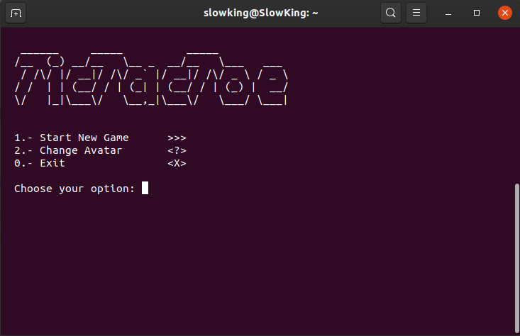

# Object Oriented Programming (Ruby): Tic Tac Toe
> In this project, the student builds a Tic Tac Toe game. The main goal is to put into practice the main concepts of Object-Oriented Programming. Particularly, classes and access to their attributes.

Tic-tac-toe is a paper-and-pencil game for two players, X and O, who take turns marking the spaces in a 3×3 grid. The player who succeeds in placing three of their marks in a horizontal, vertical, or diagonal row is the winner.

## Run the game

To get a local copy up and running follow these simple example steps.

### Prerequisites
- You need to have ***Ruby*** installed on your machine ([Check this out](https://www.ruby-lang.org/en/documentation/installation/) for instructions on installing ruby)

### Usage
To run the code go to `/bin` inside your cloned repo and run `$ main.rb` in the terminal. The main file will search automatically for your **Ruby environment** inside `/usr/bin/env`. If it can't find ruby there then you can either use ruby to load the file (`$ ruby main.rb`) or modify the first line inside `main.rb` with the path where you have Ruby installed.

*Optional*: You can create a softlink to your **$PATH** so you can run the game without having to navigate to its local folder. To do this make sure you still are in `/bin` inside the repo folder, then use the command: `$ ln -s $PWD/main.rb /usr/local/bin` to create the softlink (if the directory doesn't exist you can create it using `$ mkdir -p /usr/local/bin/`), then navigate to the link directory and rename it with anything you want like 'tictactoe' (`$ mv main.rb tictactoe`, the link doesn't need the extension **.rb** anymore), remember that this changes apply only to the link inside `/usr/local/bin` and not the repo folder. Once you finish you can run the game whenever you want just using the link's name (e.g. `$ tictactoe`).

## How to Play

Once you start the game you'll see the *Welcome Page*. From there you're presented with three options which are as follows:
1. Start New Game
2. Change Avatar
0. Exit

To select one option just input the number at the left of it.

#### Start New Game
Once you start a new game, it will ask for the names you want to use during the game. Once you're past this, the game will start and it will show you a 3x3 matrix where you put your moves. To choose a slot you must specify the coordinates of it (Column/Row) and after your input, it will be then the turn of your partner. The game ends when someone aligns three of your avatars in a straight line or when there's no space left for further moves.

#### Change Avatar
If you choose to change your avatars before starting the game then you'll have to input the avatar of the first player (*X* by default) and the one of the second player after it (*O* by default). Once you input both avatars you'll return to the main screen.

#### Exit
This option will finish the game.

## Built With

- Ruby
- VSCode

## Author

👤 **Diego Luna Granados**

- Github: [@SlowKingV](https://github.com/SlowKingV)
- Twitter: [@SlowKingVI](https://twitter.com/SlowKingVI)
- Linkedin: [Diego Luna Granados](https://www.linkedin.com/in/diego-luna-granados-64007b197/)

## 🤝 Contributing

Contributions, issues and feature requests are welcome!

Feel free to check the [issues page](https://github.com/SlowKingV/bubble-sort/issues/).

## Show your support

Give a ⭐️ if you like this project!

## 📝 License

This project is [MIT](LICENSE) licensed.
